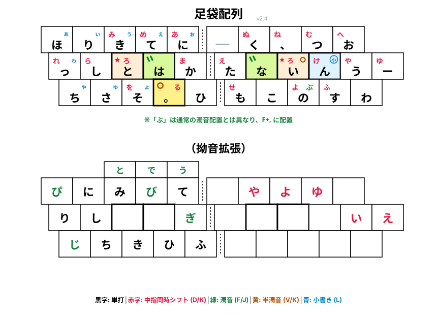

# 足袋配列

中指同時シフト、拗音拡張（記号定義は新下駄配列と同じ）

[矢次配列](https://github.com/ffunatsu/yazgi_layout)から派生した配列で、打ちにくい単語をさらに少なくするために設計した配列です。

（この配列設計のために作った[NeoJスコア](https://github.com/ffunatsu/neoj_script)を最適化する形で作りました。初期段階は機械最適化、その後手作業による修正を何度も繰り返して作っています。）

原理上、どうしても打ちづらい単語は出てきてしまうので、よく打つ文章などによって相性があると思います。

> [!Note]
> 元々は別のリポジトリがあったのですが、ドキュメント等がAI生成であったため、一から手作業で作り直しています。
>
> 今現在は限られたコンテンツしか含まれていませんが、ゆっくり少しずつ足すかもしれませんし、そのままかもしれません。

## メモ

- 中指同時シフトばかり打っていると疲れる瞬間があるので、D/Kのレイヤー面はSandS（スペースアンドシフト）でも打てるように設定ファイル等で定義してありますが、暫定です。
